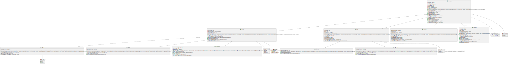

# UT5_ED_Prog
 Repositorio para la tarea 5 de Entornos de Desarrollo

## Checklist de Tareas

- [x] Crear repositorio privado para la tarea.
- [x] Añadir un README.md con una checklist.
- [x] Crear una carpeta uml/ con un fichero .puml por cada clase detectada (con estrucutra inicial determinada).
- [x] Primer commit con la estructura base súbelo al remoto (github).
- [x] Commits sucesivos (desarrollar checklist)
- [x] Diagrama UML .svg con PlantUML
- [x] Inserción del diagrama en el README.md:
  
 # DIAGRAMA DE CLASES COMPLETO:
 
